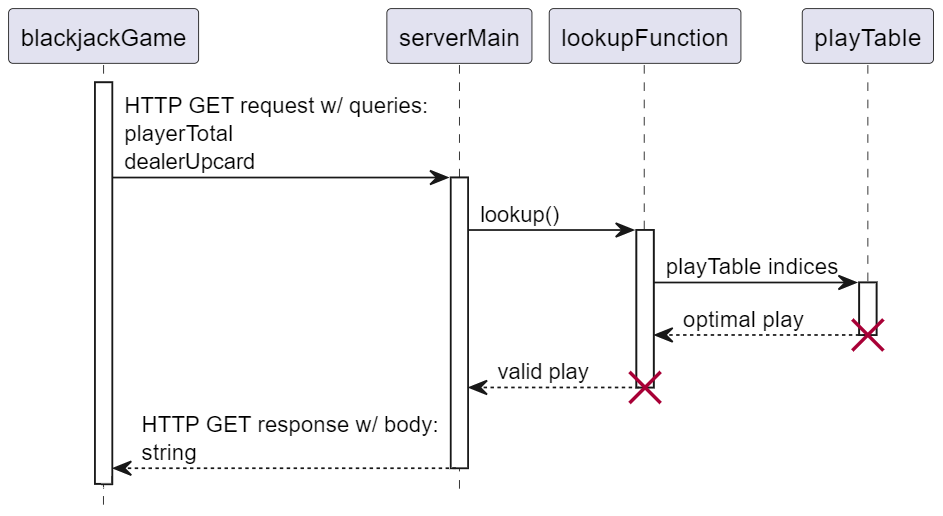

# CS_361_Recommender

An Express server that recommends blackjack strategy based on current state of play.

Dependencies:
- express
- dotenv

__________________________________________________

To install:

1) Place files in desired root direcroty.
2) Edit .env to choose desired port on localhost.
3) Open console in root directory.
4) In console, run command "npm i express" without quotes.

To start server on localhost:

1) Open console in root directory.
2) In console, run command "node index.mjs" without quotes.

To shut down server:

1) With console active, hit Ctrl+C on keyboard.

__________________________________________________

Usage:

# REQUEST

With server running, send HTTP GET request to localhost:[chosen port] with query:

  ?playerTotal=[total]&dealerUpcard=[upcard]
  
Where:

- [total] is an integer in [2..20] representing the hard total of a player's blackjack hand.
- [upcard] is an integer in [2..11] representing a blackjack dealer's upcard.
- An Ace upcard is assumed to be valued at 11 and must be submitted as that integer value.

Server will lookup optimal action under basic strategy and generate the appropriate response.

# RECEIVE

The body of the GET response will be one of two strings:

- "The odds are in you favor to stand."
- "The odds are in your favor to hit."

__________________________________________________

# UML Sequence Diagram

__________________________________________________

To review code:

- .env            defines host port
- index.mjs       is main; Express server
- lookup.mjs      function; queries play table based on GET parameters; returns strings representing recommendation
- playTable.mjs   object; array of arrays with play reccomendations based on state of play queries

* playTable is designed for human readablity rather than space efficiency.
* playTable hard total values are in descending order.
* playTable includes double-down but lookup function is configured to return a recommendation to hit in these cases.
